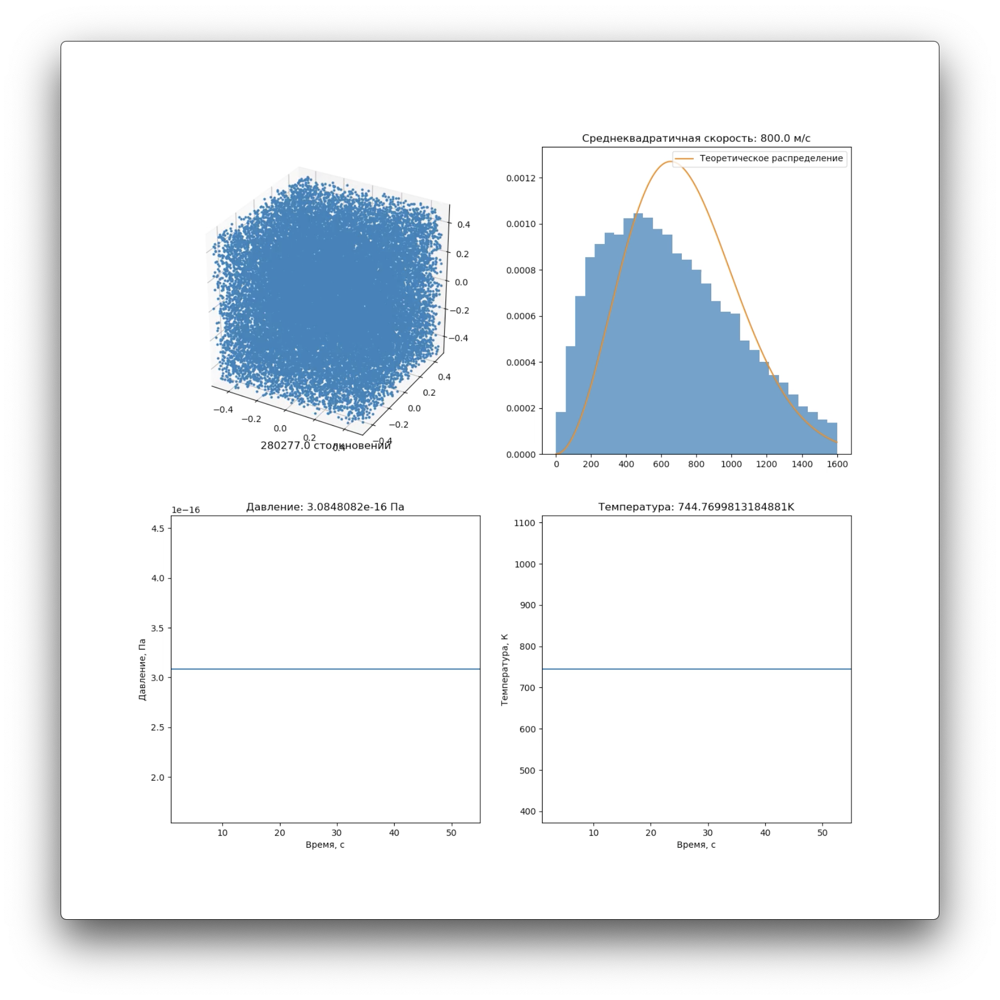
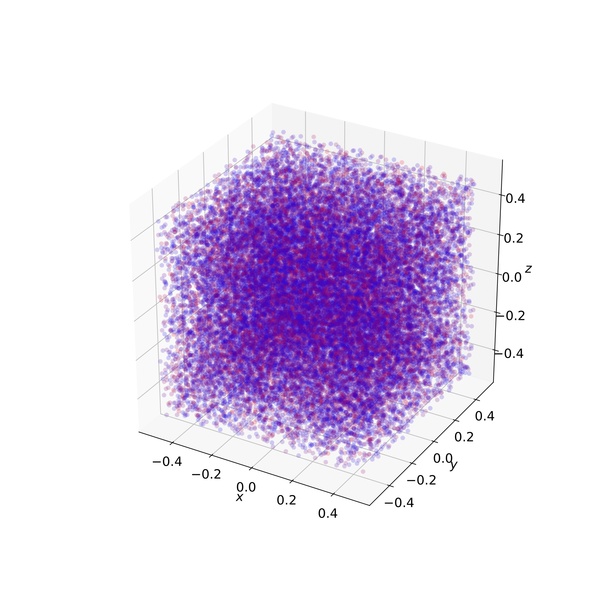

# Моделирование газа 
В репозитории находится компьютерная модель идеального газа, проверяются некоторые основные законы термодинамики: уравнение Менделеева-Клайперона, распределение Максвелла, закон Бойля-Мариотта, нормальность флуктуаций.
Особенности данной работы в том, что используется трехмерная модель газа, что уже редкость среди существуствующих проектов, а так же в том, что используются реальные параметры газов: масса молекулы и скорость.
(скопировал abstract)

[Статья](https://github.com/pilot7747/physicsSimulation/blob/master/report/report.pdf)

[Демонстрация поведение системы](https://www.youtube.com/watch?velocity=4M_ZC6nT7mI)

Состояение системы в момент dt |  Визуализация сосуда с молекулами
:-------------------------:|:-------------------------:
  |  

## Запуск симуляции:
`sudo python3 render.py --engine cmake-build-release/physics_simulation --particles 15 --duration 10 --speed 800`

## ToDO
- [] [Труды МФТИ](https://mipt.ru/science/trudy/priyom_new/)
- []  Может в Популярную механика?
